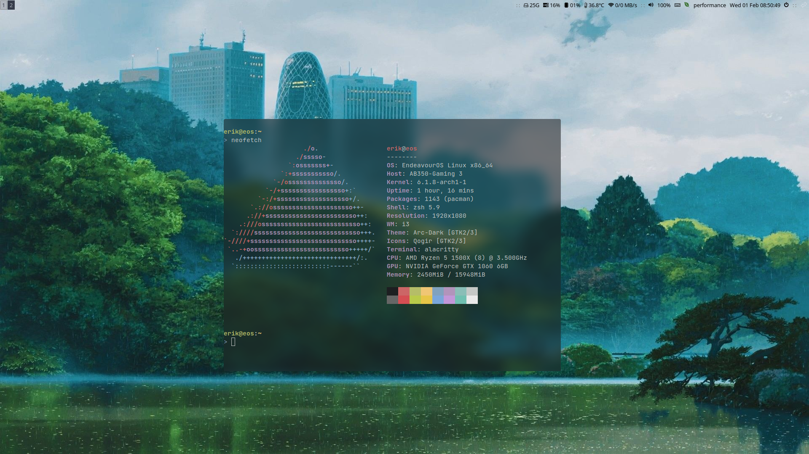

# dotfiles
**Endeavour OS**
+ alacritty
+ zsh (oh-my-zsh)
+ i3
+ picom
+ nvim
+ tmux
+ ranger
+ lazygit

Migrating to Void linux for now, will also try out a minimal DWM setup. Will update when I feel like it...
