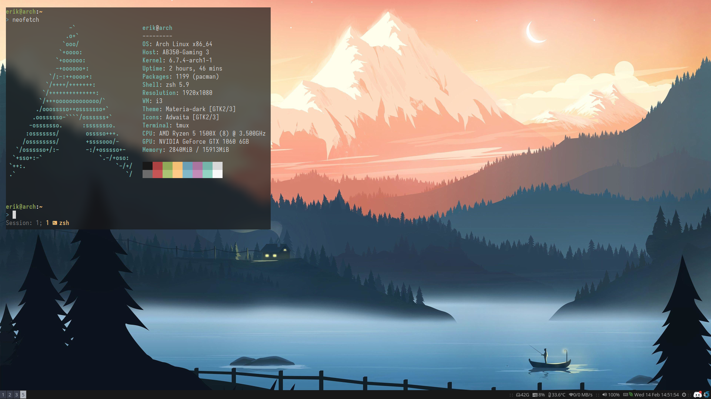

<h1 align="middle">Dotfiles</h1>

**Arch Linux**

- alacritty
- zsh (oh-my-zsh)
- i3
- picom
- nvim
- tmux
- ranger
- lazygit
- zathura
- mpv

## Clone and Install

```sh
# Clone from home folder
$ git clone git@github.com:Ericrulec/dotfiles.git

# Move into dotfiles
$ cd dotfiles

# Symlink homefolder/dotfiles/* -> homefolder/*, equivalent to $ ln -s <src> <dest>
$ stow .

```

## Dependencies

```sh
# Install with your preferred package-manager

git-delta exa

```


